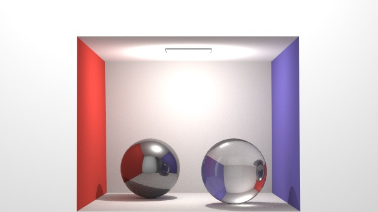

# 64_mesh_obj_demo64

## Description

Describe a scene in .json file using .obj files and render in RPR. 

## Examples

`./64_mesh_obj_demo64 sphere.json`

`./64_mesh_obj_demo64 cornellbox.json`

`./64_mesh_obj_demo64 test.json`

