# AMD Radeon:tm: ProRender SDK Tutorials

List of tutorials in this SDK

| Model                                                      | Screenshot                                          | Description |
|------------------------------------------------------------|-----------------------------------------------------|-------------|
| [Context Creation](00_context_creation)                    | 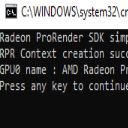             | This demo shows how to create a RPR context. The RPR context is the first object that needs to be created before any RPR renderings. |
| [Parameters Enumeration](03_parameters_enumeration)        | 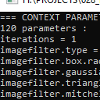       | This tutorials illustrates how to use getters of the RPR API to get current states/values of different objects. |
| [Basic Scene](05_basic_scene)                              | 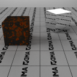                  | This demo is a good starting point to learn all the basic features of RPR. You'll learn how to manage  geometry, light, camera, framebuffer, materials for simple cubes renderings. |
| [Transform Motion Blur](12_transform_motion_blur)          | 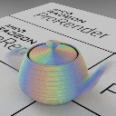        | This demo covers shape and camera matrix transform changed over time for a blur effect. Note that this is different compared to a Deformation motion blur ( illustrated in [Deformation Motion Blur](13_deformation_motion_blur) ) where we set each vertex individually over time. Here it's simpler: we just change the transform matrix. This demo also illustrates how we can export the blur with the RPR_AOV_VELOCITY AOV. |
| [Deformation Motion Blur](13_deformation_motion_blur)      | 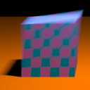      | This demo covers vertices deformation over time for a blur effect. |
| [Camera DOF and Adaptive Sampling](17_camera_dof)          | 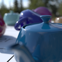                   | This demos shows how to configure camera Depth of Field. It also uses Adaptive Sampling for the rendering algorithm. |
| [Material](21_material)                                    | 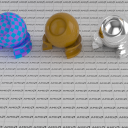                     | This demo illustrates how to create materials in RPR. It's not covering the UBER material which is used inside the 22_material_uber demo. |
| [Uber Material](22_material_uber)                          | 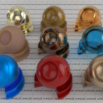                | This demo illustrates examples for the UBER ( RPR_MATERIAL_NODE_UBERV2 ) material.  |
| [Two Sided materials](23_twosided)                         | 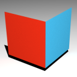                     | This demo illustrates how to define different materials on the front and back face of mesh faces.  |
| [Contour](24_contour)                                      | 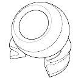                      | Demo of the Contour Rendering (also called Outline) that allows you to render contours of 3D objects. |
| [Toon Material](25_toon)                                   |                          | This demo illustrates how to use the Toon material. |
| [MaterialX Demo](26_materialx)                             | 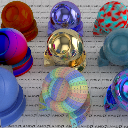                    | Radeon ProRender is compatible with MaterialX. This tutorial demonstrates how to use it. |
| [Cutting Planes](27_cutplanes)                             | 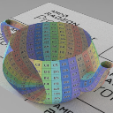                    | This demos shows how to add Cutting planes (also called Clipping plane). |
| [IES lights](28_ies_light)                                 | 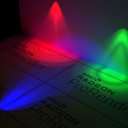                    | This demos shows how to use IES (Illuminating Engineering Society) lights. |
| [OCIO](29_ocio)                                            | 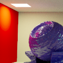                         | Demo of the OpenColorIO workflow. We show how to render a scene inside the ACEScg colorspace. |
| [Tiled Render](30_tiled_render)                            | 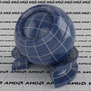                 | This demo illustrates how to break down the framebuffer into smaller render regions (tiles). |
| [Framebuffer access](31_framebuffer_access)                | 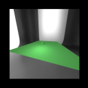           | Here we demonstrate usage of rprFrameBufferGetInfo: We can access the image data of a frame buffer. In this demo, we use the data of a first rendering and use it as an input texture for a second rendering. It also contains an example of DeepEXR framebuffer export. |
| [OpenGL interop](32_gl_interop)                            | 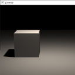                   | Demo covering an RPR rendering inside an OpenGL app. |
| [AOVs](33_aov)                                             | 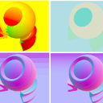                          | This demo covers AOV (Arbitrary Output Variables), providing way to render different material component - mostly used for scene debugging. |
| [Material Per Face](34_material_per_face)                  | 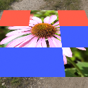            | Demo of the rprShapeSetMaterialFaces API. This allows to set materials for specific faces of the shape. |
| [Advanced Texturing](35_advanced_texturing)                | 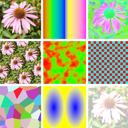           | This demo shows different features related to texture manipulation: Manage the UV, create procedural textures, use arthmetics and custom materials, texture wrapping. |
| [Shadow Catcher](36_shadow_catcher)                        |                | Demo of the Shadow Catcher. If a shape has this feature activated, it will "catch" the shadow. This shadow quantity can be rendered on a dedicated AOV. |
| [Primvar](37_primvar)                                      | 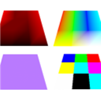                      | Demo of the Primvar. With this feature you can assign additional sets of parameters to rpr_shape. Those parameters can be for example: a scalar, 2-float UVs, 3-floats colors. They can be uniform to the whole shape, per vertice or per face. |
| [Curves](50_curve)                                         |                         | Demo covering Curves rendering. Curves are often used for hair rendering. |
| [Volume](51_volume)                                        | 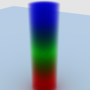                       | This demo demonstrates Volumes with RPR |
| [RPR Scene Export](60_mesh_export)                         | 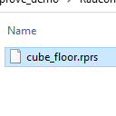                  | Shows how to export an RPR scene as RPRS files ( native RPR file format ) or GLTF ( Khronos Group ). |
| [RPR Scene Import](61_mesh_import)                         | 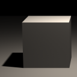                  | Shows how to import an RPR scene as RPRS files ( native RPR file format ) or GLTF ( Khronos Group ). It's advised to execute the demo "60_mesh_export" first in order to create the files used in this "61_mesh_import" Demo. |
| [Hybrid](63_hybrid)                                        | 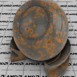                       | This is a demo for the Hybrid.DLL plugin. |
| [Mesh OBJ Demo](64_mesh_obj_demo)                          | 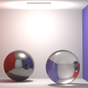                | Project that imports and renders any OBJ file with Radeon ProRender. |

